### 1. Herramientas y Servicios DevOps en Microsoft Azure

Microsoft azure es un conjunto de servicios nativos y herramientas administradas en la nube que cubren todas las etapas del ciclo de la etapa del software visto en clases, estos son: 
* **Planificación (Azure Boards):** Servicio de gestión de proyectos ágiles. Permite a los equipos realizar seguimiento del trabajo, defectos y problemas mediante tableros Kanban y Scrum.
* **Desarrollo y Control de Versiones (Azure Repos / GitHub):** Repositorios privados en la nube para gestionar el código fuente mediante Git. (Azure integra GitHub de forma nativa como plataforma hermana).
* **Integración Continua (Azure Pipelines / GitHub Actions):** Plataforma para automatizar la compilación y las pruebas del código (CI). En la etapa de CI, toma el código de NestJS, ejecuta los tests unitarios y construye la imagen Docker de la aplicación.
* **Almacenamiento de Artefactos (Azure Container Registry - ACR):** Servicio para construir, almacenar y gestionar imágenes de contenedores y artefactos de forma segura. Aquí se guarda la imagen de NestJS compilada.
* **Orquestación de Contenedores (Azure Kubernetes Service - AKS):** Servicio administrado de Kubernetes que permite desplegar, administrar y escalar aplicaciones basadas en contenedores. AKS simplifica la administración del clúster al encargarse de las actualizaciones, alta disponibilidad y escalabilidad automática de la infraestructura.
* **Infraestructura como Código (Azure Bicep / Terraform):** Azure permite definir toda la infraestructura mediante archivos de configuración. Bicep es el lenguaje nativo de Microsoft para crear recursos Azure.
* **Despliegue Continuo (Azure App Service / Azure Database for PostgreSQL):** Servicios de plataforma (PaaS) donde se ejecuta la aplicación en producción. App Service levanta el contenedor de la API, mientras que Azure Database for PostgreSQL administra la base de datos relacional sin necesidad de orquestar la infraestructura subyacente.
* **Monitoreo y Operación (Azure Monitor & Application Insights):** Herramientas de observabilidad que recopilan telemetría, métricas de rendimiento y logs en tiempo real. Se aplican en la etapa de operación para detectar cuellos de botella (ej. consultas lentas a la base de datos) y generar alertas automáticas.

---

### 2. Diagrama de Arquitectura Cloud DevOps

A continuación se presenta el flujo de arquitectura, mostrando cómo las herramientas interactúan para desplegar una API con base de datos en PGSQL.

```mermaid
%%{init: {"flowchart": {"defaultRenderer": "elk"}}}%%
graph LR
    %% Definición de Actores y Entornos
    Dev([Desarrollador])
    
    subgraph CI_CD ["Pipeline CI/CD (GitHub / Azure DevOps)"]
        Repo[Repositorio de Código \n Git / main]
        Build[Action / Pipeline \n Compilación y Tests]
    end

    subgraph Azure_Cloud ["Microsoft Azure Cloud"]
        ACR[(Azure Container \n Registry)]
        
        subgraph Produccion ["Entorno de Producción"]
            App[Azure App Service \n Contenedor NestJS]
            DB[(Azure Database \n for PostgreSQL)]
        end
        
        Monitor[Azure Monitor & \n Application Insights]
    end

    %% Flujo de Integración y Despliegue
    Dev -- "1. Push / Merge (Trunk-Based)" --> Repo
    Repo -- "2. Dispara el flujo" --> Build
    Build -- "3. Sube imagen Docker" --> ACR
    ACR -- "4. Despliega imagen (Webhook)" --> App
    App -- "5. Conexión ORM/Credenciales" <--> DB
    
    %% Flujo de Monitoreo
    App -. "Telemetría y Logs" .-> Monitor
    DB -. "Métricas de consumo" .-> Monitor

    %% Estilos
    classDef azure fill:#0072C6,stroke:#fff,stroke-width:2px,color:#fff;
    classDef cicd fill:#24292E,stroke:#fff,stroke-width:2px,color:#fff;
    classDef db fill:#336791,stroke:#fff,stroke-width:2px,color:#fff;
    
    class ACR,App,Monitor azure;
    class Repo,Build cicd;
    class DB db;

```

---

### 3. Cuadro Comparativo de Herramientas 

La siguiente tabla contrasta las herramientas estándar de la industria (vistas en clases) con las soluciones administradas o equivalentes nativos dentro del ecosistema de Microsoft Azure.

| Herramienta (Clase) | Equivalente en Azure | Similitudes | Diferencias |
| --- | --- | --- | --- |
| **GitHub** | Azure Repos | Ambos ofrecen control de versiones distribuido basado en Git, revisión de código (Pull Requests) y gestión de ramas. | Azure Repos está estrictamente integrado a la suite empresarial de Azure DevOps, mientras que GitHub tiene un enfoque más fuerte en la comunidad Open Source y la seguridad (Advanced Security). |
| **Jenkins** | Azure Pipelines | Ambos automatizan flujos de CI/CD, soportan agentes de compilación (Linux/Windows) y ejecutan scripts mediante archivos declarativos (YAML). | Jenkins requiere administrar, parchar y hostear el servidor principal (self-hosted). Azure Pipelines es 100% serverless y administrado por Microsoft. |
| **SonarQube** | Microsoft Defender for Cloud | Ambos analizan vulnerabilidades, calidad de código y aplican políticas de seguridad. | SonarQube se enfoca principalmente en la calidad del código fuente (deuda técnica). Defender for Cloud analiza la infraestructura completa (redes, contenedores, bases de datos). |
| **Docker** | Azure Container Registry (ACR) | Ambos empaquetan, versionan y distribuyen imágenes de software para garantizar la inmutabilidad entre entornos. | Docker es el motor local. ACR es un repositorio privado en la nube equivalente a Docker Hub, pero con escaneo de seguridad nativo y control de acceso de Azure (IAM). |
| **Kubernetes** | Azure Kubernetes Service (AKS) | Ambos orquestan contenedores, gestionan el auto-escalado, el balanceo de carga y la auto-reparación de microservicios. | Kubernetes "vainilla" requiere configurar los nodos maestros a mano (difícil). AKS abstrae el plano de control (Control Plane), dejándolo bajo la administración automática y gratuita de Azure. |
| **Ansible / Terraform** | ARM Templates / Bicep | Ambos aplican el concepto de Infraestructura como Código (IaC) para aprovisionar servidores de forma declarativa e idempotente. | Terraform y Ansible son "Agnósticos de Nube" (funcionan en AWS, GCP, etc.). ARM/Bicep son lenguajes nativos y exclusivos de Azure, ofreciendo soporte día cero para nuevos servicios. |
| **ELK Stack** | Azure Log Analytics | Ambos centralizan registros dispersos, permiten buscar patrones en millones de líneas de texto y generar tableros visuales. | ELK requiere levantar y conectar Elasticsearch, Logstash y Kibana. Log Analytics funciona automáticamente inyectando un agente o conectando el recurso directamente desde el portal. |
| **Prometheus / Grafana** | Azure Monitor / App Insights | Ambos recopilan métricas de series temporales (CPU, RAM, peticiones HTTP) y crean alertas basadas en umbrales de rendimiento. | Prometheus opera bajo un modelo "Pull" (raspa métricas localmente). Azure Monitor es un servicio global unificado que recopila métricas pasivamente de todos los recursos del tenant (modelo "Push"). |